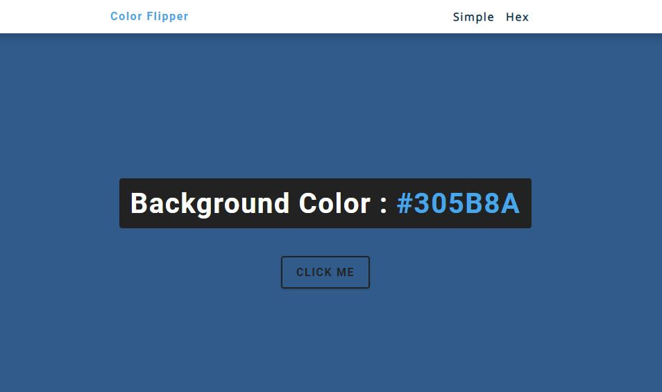

# Project - Color Flipper

## Project Details :

_Whenever a user wants to generate new colors, they need to click the button and a random number will generate along with hex value_

- Project Live Link : 

### Technology Used -

- HTML
- CSS
- Vanilla Javascript

### Key Learnings from the project -

1. Project Planning & its Execution
2. Key Project Structure & its elements
3. HTML Structure to invok JS code
4. Vanilla JS execution on elements to execute step-by-step
5. Advanced DOM Manipulation
6. Project Testing
7. Github & Vercel utilisation

- Project Live Link : 

### - Developed by [Aniruddha](https://github.com/AniruddhaDas1) | CoderX Community | [Send Message to WhatsApp](https://wa.me/9123987124)
